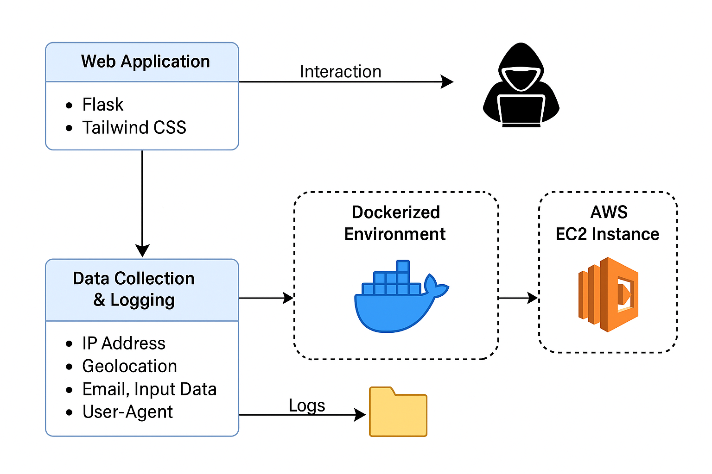

<div align="center">

# 🍯 Honeypot-as-a-Service (HaaS)

</div>


A modern, educational honeypot platform designed to simulate a vulnerable healthcare management system. HaaS helps security professionals and students learn about attack detection, logging, and incident response in a realistic environment.

<br>

>  **This project was developed as the semester project for the DevOps course in the 6th semester of my Bachelor's in Cyber Security.**

---

##  Architecture Overview



---

##  Features

- **Realistic Healthcare Web App**: Simulates patient management, document uploads, and user authentication.
- **Built-in Honeypot Traps**: Hidden endpoints and intentional vulnerabilities (SQLi, XSS, path traversal) to attract attackers.
- **Comprehensive Logging**: Tracks access, errors, and attack attempts with geolocation and browser fingerprinting.
- **Modular Design**: Easily extensible for new traps, logging mechanisms, or integrations.
- **Cloud-Ready**: Deployable via Docker or Terraform on AWS for scalable, real-world scenarios.

---

## 📁 Project Structure

```

Honeypot-as-a-Service/
├── .github/
│   └── workflows/              # CI/CD pipeline (e.g., deploy.yml)
├── data/                       # Optional: demo datasets, backups, etc.
│   ├── patients.csv
│   └── users.csv
├── logs/                       # Recon & system logs
│   ├── access.log
│   ├── attack.log
│   ├── error.log
│   └── honeypot.log
├── myenv/                      # Local Python virtual environment 
│   ├── Include/
│   ├── Lib/
│   └── Scripts/
├── terraform/                  # Infrastructure as Code
│   ├── main.tf                 # EC2 provisioning config
│   ├── terraform.tfstate       # Terraform state file (generated)
│   ├── terraform.tfstate.backup
│   └── .terraform/             # Terraform provider plugins
├── uploads/                    # (Optional) Attacker file uploads are saved here
├── webapp/                     # Main Flask honeypot web application
│   ├── app.py                  # Core server logic (request recon, logging)
│   ├── templates/              # HTML templates (admin login, dashboard, etc.)
│   │   ├── architecture.png    # Visual architecture diagram
│   │   ├── index.html
│   │   ├── login.html
│   │   ├── dashboard.html
│   │   └── view_patient.html   # Fake pages for realism
│   └── utils/                  # Python utility functions
│       └── logger.py           # Handles writing CSV recon logs
├── Dockerfile                  # Docker configuration
├── docker-compose.yml          # Runs multi-container setup if needed
├── requirements.txt            # Python dependency list
├── README.md                   # Full project overview
└── documentation/              # All project write-ups and final report


````

---

##  Installation

### Prerequisites
- Python 3.8+
- Docker (optional)
- Terraform (optional for AWS deployment)

### Local Development Setup

1. Clone the repository:
```bash
git clone https://github.com/B3TA-BLOCKER/Honeypot-as-a-Service.git
cd Honeypot-as-a-Service
````

2. Install Python dependencies:

```bash
pip install -r requirements.txt
```

3. Run the application:

```bash
python webapp/app.py
```

### Docker Setup

```bash
docker-compose up --build
```

### AWS Deployment

1. Install Terraform
2. Configure AWS credentials
3. Deploy:

```bash
cd terraform
terraform init
terraform apply
```

---

##  Usage

After setup, access the application at:

* Local: [http://localhost:5000](http://localhost:5000)
* Docker: [http://localhost:5000](http://localhost:5000)
* AWS: Use the public IP output by Terraform

Default credentials:

* Username: `admin`
* Password: `admin`

---

##  Attack Simulation

The system includes intentional vulnerabilities:

1. SQL Injection: Try `/api/v1/search?q=' OR 1=1--`
2. XSS: Try submitting `<script>alert(1)</script>` in forms
3. Path Traversal: Try accessing `/../../etc/passwd`

All attack attempts are logged in `logs/attack.log`.

---

##  Logging

Logs are stored in:

* `logs/access.log`: All HTTP requests
* `logs/attack.log`: Detected attack attempts
* `logs/error.log`: Application errors

Logs include:

* Timestamps
* IP addresses
* Geolocation data
* Browser fingerprints
* Attack details

---

## 🤝 Contributing

1. Fork the project
2. Create your feature branch (`git checkout -b feature/AmazingFeature`)
3. Commit your changes (`git commit -m 'Add some AmazingFeature'`)
4. Push to the branch (`git push origin feature/AmazingFeature`)
5. Open a Pull Request

---

## ⚖️ License

Distributed under the MIT License. See `LICENSE` for more information.

